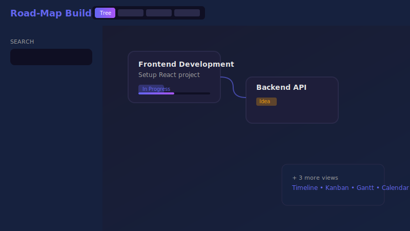

# 🗺️ Road-Map Builder

[](https://arerii7.github.io/roadmap-builder/)
[](https://opensource.org/licenses/MIT)

A web application for visualizing roadmap projects with multiple view modes.



## ✨ Features

| Category | Functions |
|----------|-----------|
| **Views** | Tree • Timeline • Kanban • Gantt • Calendar |
| **Tasks** | Subtasks, tags, progress (0-100%), priorities |
| **Tools** | Drag-n-drop, filters, search, undo/redo |
| **Export** | JSON, PNG |

### Additional
- 🌙 Dark/Light theme
- 🌐 Russian/English language
- ⌨️ Keyboard shortcuts
- 💾 Auto-save to localStorage

## 🚀 Live Demo

👉 **https://arerii7.github.io/roadmap-builder/**

## Quick Start (Local)

```bash
git clone https://github.com/Arerii7/roadmap-builder.git
cd roadmap-builder
# Open index.html in your browser
```

## ⌨️ Keyboard Shortcuts

| Key | Action |
|-----|--------|
| `Del` | Delete |
| `Esc` | Close |
| `Ctrl+N` | New task |
| `Ctrl+S` | Export |
| `Ctrl+Z/Y` | Undo/Redo |
| `Ctrl+scroll` | Zoom |
| `Shift+drag` | Pan |

## 🛠 Tech Stack

Pure JS • HTML5 • CSS3 • LocalStorage

## 📄 License

MIT